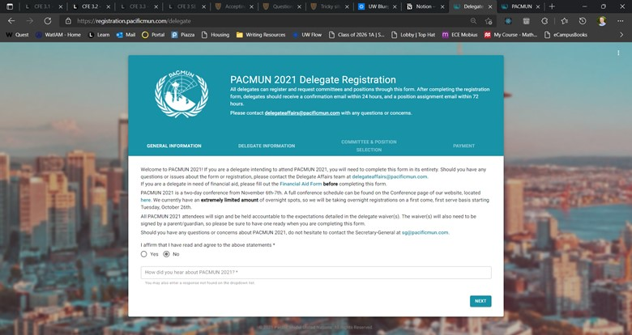
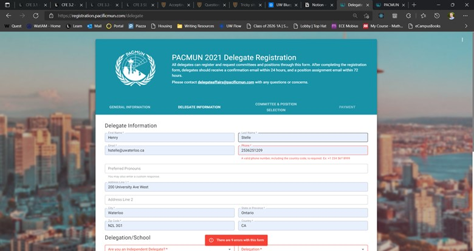
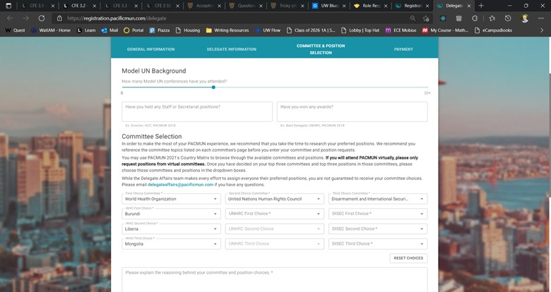
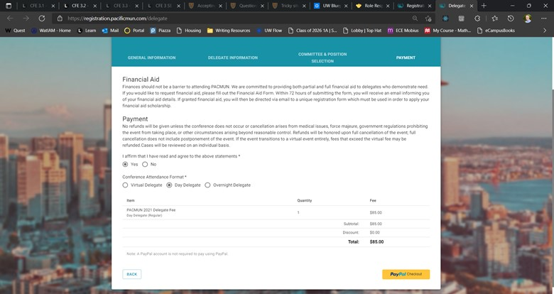
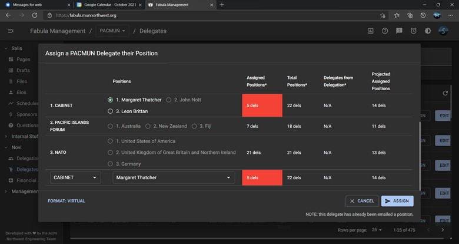
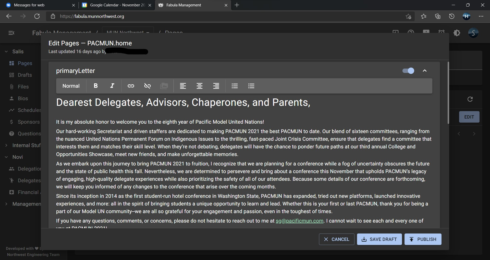

# fabula-portfolio

[Model United Nations Northwest (MUN NW)](https://munnorthwest.org/) is an non-profit organization based in Washington state that host the MUN conferences of [EDUMUN](https://edumun.com/), [PACMUN](https://pacificmun.com/), [KINGMUN](https://kingmun.org/), and [SeattleMUN](https://seattlemun.org/). In January of 2020, I formed the Engineering Team to create a custom content mangement system (Salis) the different conference secretariats could use to manage their websites without requiring a USG of Tech to manually edit the code and acociated registration forms (Novi) that allowed delegations and delegates to easily register while simultatious automatting repeated actions.

# Novi

The Novi registraiton forms use React-Hook-Form to manage the forms' state and Material UI to style the components.

### Page 1

The secretariat can customize the form's background image and the textual content of the form, but not the questions.

### Page 2

The React-Hook-Form builtin validators are used incongunction with Validator.js's to provide comprehensive input validation as the form is being edited and when the user submits the form.

### Page 3

Delegates are allowed to rank three committee and three positions per committee that they would like to be placed in. The dropdowns use the live registration data to only display positions that are currently open.

The delegate regsitration form (pictured) is linked to the delegations registration form, so delegates may only select valid delegations that have been approved by the secretariat. (The secretariat recieves a Slack notification when a delegation registers).

### Page 4

The registation uses PayPal to process delegate payments (which was a pain to set up, I do not recommend the PayPal API).

Additionally, delegates can also apply for finnacial aid to recieved discounted registration fees. These delegates are provided a custom regsitration link that pre-fills all questions that were already answered in the financial aid registration form.

# Fabula Management

The secretariat can edit the content of their conference's website, assign delegates finacial aid or positions through the Fabula Management website. This website leverages [Google Identity Sevices](https://developers.google.com/identity/gsi/web) to restrict access to MUN NW volenteers. Addition resource-based access control ensures that sisitive data is only accessable by approved secretariat members.

## Novi

### Delegate Assignment Module

In addition to the edit functionality, Fabula features financial aid and delegate assignment (pictured below) modules to simplify the processes and eliminate simple mistakes that frequently occured using the previous methods (Google Sheets) such as double-assignment or sending the confirmation emails to the wrong person.

Specially, the delegate assignment module will only allow secretariat members to assign a delegate to open positions and shows the secretariat how full the given committees and how many delegates from the given delegate's delegation are present in the committee to ensure an even distrobution. Additionally, the module anonmizes the delegate's personal information to minimize the impact of nnconscious bias.

## Salis

The Salis portion of the Fabula website allows the secretariat to edit the textual content and background images of the different pages of their respective websites. It intially does not allow them to change the desgin of the website in order maintain a consitent theme across the different pages.

The most complicated part by far is the custom rich text editor GUI based on Slate.js. I chose to create my own GUI instead of using one of the many pre-build editors because I did't like their visual appearance or because they clashed with the rest of the website.

